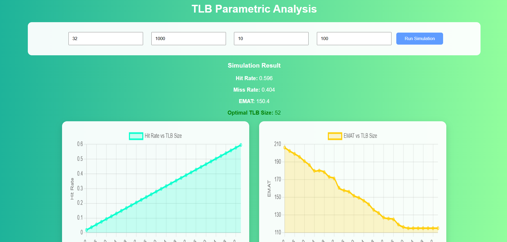

# TLB Parametric Analysis

## Overview

TLB Parametric Analysis is a web-based simulation application developed to analyze the performance of a **Translation Lookaside Buffer (TLB)**. The application simulates memory accesses using randomly generated page references and evaluates TLB performance using the **Least Recently Used (LRU)** page replacement policy.

The simulator calculates important performance metrics such as **Hit Rate**, **Miss Rate**, and **Effective Memory Access Time (EMAT)**. It also determines the **optimal TLB size** by comparing EMAT values across multiple TLB configurations.

---
---

## Application Interface

The following screenshot shows the user interface of the TLB Parametric Analysis application. Users can enter simulation parameters, run the analysis, and view the calculated performance metrics along with graphical results.



---
## Objective

The objective of this project is to:

- Simulate the behavior of a Translation Lookaside Buffer (TLB).
- Analyze how TLB size affects memory performance.
- Calculate the TLB Hit Rate and Miss Rate.
- Compute the Effective Memory Access Time (EMAT).
- Determine the optimal TLB size that minimizes EMAT.
- Provide a simple web interface for performing TLB performance analysis.

---

## Features

- User-friendly web interface
- Simulation using randomly generated page references
- Least Recently Used (LRU) replacement algorithm
- Calculates:
  - TLB Hit Rate
  - TLB Miss Rate
  - Effective Memory Access Time (EMAT)
- Finds the optimal TLB size
- Displays graphical analysis of:
  - Hit Rate vs TLB Size
  - EMAT vs TLB Size

---

## Technologies Used

### Backend
- Python
- Flask
- Flask-CORS

### Frontend
- HTML
- CSS
- JavaScript
- Chart.js

---

## Project Structure

```
TLB-Parametric-Analysis/
│
├── backend/
│   ├── app.py
│   ├── analysis.py
│   ├── optimizer.py
│   └── tlb.py
│
├── frontend/
│
├── requirements.txt
└── README.md
```

---

## Installation

### 1. Clone the repository

```bash
git clone https://github.com/jeslingiby25-stack/TLB-Parametric-Analysis.git
```

### 2. Navigate to the project folder

```bash
cd TLB-Parametric-Analysis
```

### 3. Install the required dependencies

```bash
pip install -r requirements.txt
```

### 4. Start the Flask server

```bash
python backend/app.py
```

### 5. Open the application

Open the frontend in your web browser and run the simulation using your preferred parameters.

---

## Simulation Parameters

The simulator accepts the following inputs:

- **TLB Size**
- **Number of Memory References**
- **TLB Access Time**
- **Main Memory Access Time**

After running the simulation, the application displays:

- Hit Rate
- Miss Rate
- Effective Memory Access Time (EMAT)
- Optimal TLB Size
- Hit Rate vs TLB Size graph
- EMAT vs TLB Size graph

---

## Sample Output

The application generates a simulation report similar to the following:

- Hit Rate
- Miss Rate
- EMAT
- Optimal TLB Size
- Performance graphs showing Hit Rate and EMAT for different TLB sizes

---


## Future Enhancements

- Support multiple page replacement algorithms (FIFO, LFU, Random)
- Allow custom page reference strings
- Export simulation results
- Save simulation history
- Compare multiple simulation runs

---

## License

This project was developed for educational purposes as part of an academic project.
